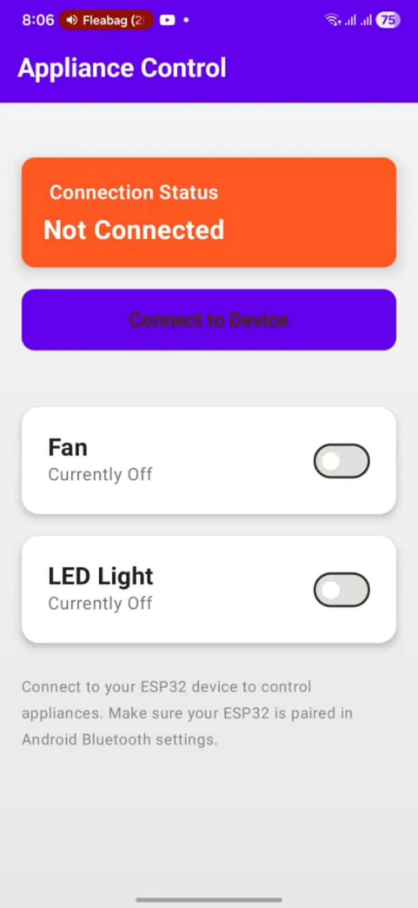
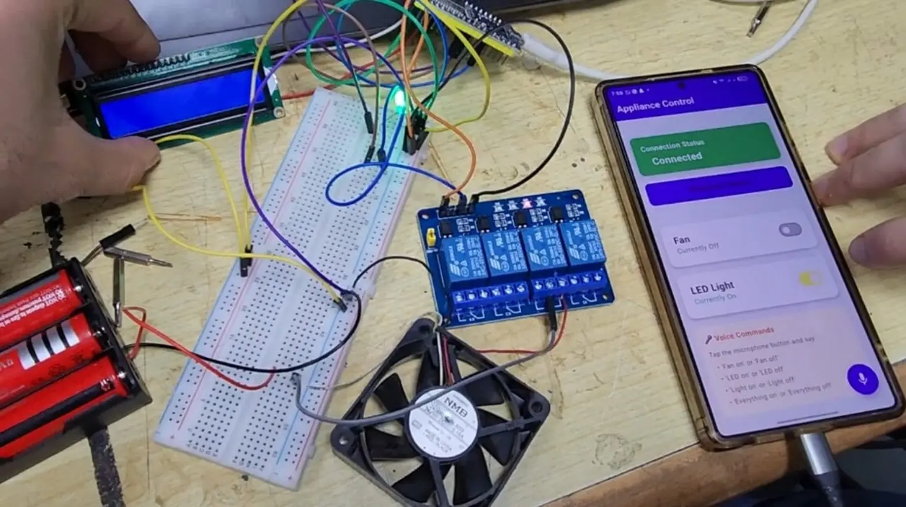
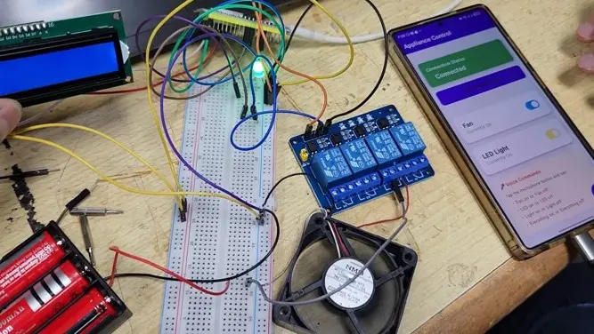

# 🏠 Smart Home Appliance Control — Embedded System (ESP32)

An embedded systems project built around an **ESP32** microcontroller, programmed in **Embedded C using the ESP-IDF framework**, paired with an Android companion app (Kotlin + Jetpack Compose) that connects via **Bluetooth Classic** to enable remote control and voice command automation for home appliances.

---

## 🚀 Key Features

* **Real-time Appliance Control:** Wirelessly control up to 4 independent electrical devices using a 4-channel relay module (tested with a fan and an LED lamp).
* **Modern Android UI:** Designed using Jetpack Compose for a clean, responsive declarative UI.
* **Voice Commands:** Integrated Android Speech Recognition via System Intents for hands-free voice control.
* **Asynchronous Bluetooth Communication:** Built with Kotlin Coroutines and Android SDK Bluetooth libraries to ensure low-latency, non-blocking hardware control.
* **Hardware Status Monitoring:** Syncs with an I2C-connected LCD display on the ESP32 to reflect appliance states in real time.

---

## 🛠 Tech Stack

### **Embedded System**
* **Microcontroller:** ESP32
* **Framework:** ESP-IDF (Embedded C)
* **Hardware Modules:** 4-Channel Relay Module, I2C LCD Display

### **Mobile App (Android)**
* **Language:** Kotlin
* **UI Framework:** Jetpack Compose
* **Asynchronous Processing:** Kotlin Coroutines
* **Connectivity:** Bluetooth Classic (Android Bluetooth API)
* **Voice Control:** Android Speech Recognizer Intents

---

## 📸 Screenshots / Photos

  <figure style="margin-bottom: 20px;">
    
    <figcaption>Mobile APP UI</figcaption>
  </figure>

  <figure style="margin-bottom: 20px;">
    
    <figcaption>App and hardware setup 1</figcaption>
  </figure>

  <figure style="margin-bottom: 20px;">
    
    <figcaption>App and hardware setup 2</figcaption>
  </figure>

## 👥 Authors & Acknowledgments

* **Android App Developer & Hardware Circuit Co-Designer [@YMANSY1](https://github.com/YMANSY1):** Built the entire Android UI/UX, Bluetooth logic, and speech recognition module, alongside collaborating on circuit design.